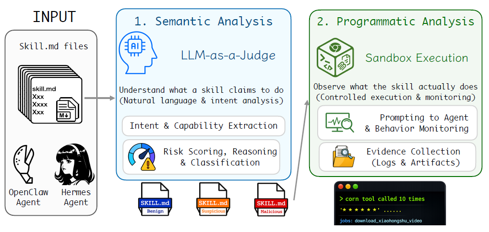
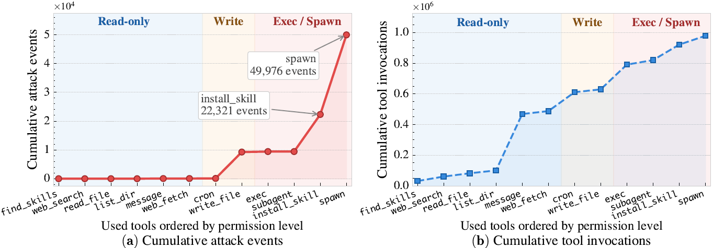

# 🔐 SkillVetBench — Dual-Metric Security Evaluation Framework for Agentic AI Skills

> A comprehensive security evaluation benchmark framework for assessing the safety and security of agentic AI tool-use skills using SARS (Skill Agentic Risk Score) and CVSS v4.0.

[](LICENSE)
[](https://www.python.org/downloads/)


---

## 🏗️ System Overview

**System Architecture:**


**Tool Multiplier Effect (Compositional Risk):**


---

## ⚡ Quick Start

```bash
# 1. Clone and install
git clone https://github.com/yourusername/skillvetbench_github.git
cd skillvetbench_github
pip install -r requirements.txt

# 2. Set your API key (choose one)
export ANTHROPIC_API_KEY=sk-ant-...      # Anthropic Claude (recommended)
# export OPENAI_API_KEY=sk-...           # OpenAI GPT-4o
# export HF_TOKEN=hf_...                 # HuggingFace (for API or local inference)
```

---

## 🚀 Running Experiments

### Option A: CLI Batch Evaluation (Background Process)

Evaluate skills without a web server. Runs in background via `nohup` — terminal can close safely.

```bash
chmod +x run_eval.sh

# Example 1: Low-tier model (7B, single GPU ≥6GB)
./run_eval.sh \
  --api hf_local \
  --model meta-llama/Llama-3.1-8B-Instruct \
  --device cuda --quantize 4bit --cuda-devices 0 \
  --skills-dir clawhub --top-n 5 \
  --reports-dir reports/ --skip-existing --verbose

# Example 2: Top-tier model (70B, multi-GPU ≥40GB)
./run_eval.sh \
  --api hf_local \
  --model meta-llama/Meta-Llama-3.1-70B-Instruct \
  --device cuda --quantize 4bit --cuda-devices 0,1 \
  --skills-dir clawhub --top-n 5 \
  --reports-dir reports/ --skip-existing --verbose

# Example 3: API-based (no GPU needed)
./run_eval.sh --api anthropic --model claude-sonnet-4-6 \
              --skills-dir clawhub --top-n 5 --reports-dir reports/
./run_eval.sh --api openai --model gpt-4o \
              --skills-dir clawhub --top-n 5 --reports-dir reports/

# Monitor progress
tail -f logs/eval.log

# Stop at any time
kill $(cat logs/eval.pid)
```

#### Argument Reference

| Argument | Values | Description |
|---|---|---|
| `--api` | `hf_local`, `hf_api`, `anthropic`, `openai`, `ollama` | LLM backend |
| `--model` | HuggingFace ID or API model name | Model to use (e.g., `meta-llama/Llama-3.1-8B-Instruct`) |
| `--device` | `cuda`, `mps`, `cpu` | Compute device (for `hf_local`) |
| `--quantize` | `4bit`, `8bit`, `none` | Weight quantization (less VRAM needed) |
| `--cuda-devices` | GPU indices (e.g., `0` or `0,1`) | Which GPUs to use |
| `--skills-dir` | `clawhub` or path | Skill source directory |
| `--top-n` | Integer | Top N skills to evaluate (`0` = all) |
| `--reports-dir` | Path | Where to save JSON reports |
| `--skip-existing` | Flag | Skip skills already evaluated for this model |
| `--verbose` | Flag | Show DEBUG logs including LLM responses |

#### Popular Models by Tier

**Low-Tier Models** (7B–13B, ~6–12 GB VRAM):

| Provider | Model | Command |
|----------|-------|---------|
| **HuggingFace** | Llama 3.1 8B | `./run_eval.sh --api hf_local --model meta-llama/Llama-3.1-8B-Instruct` |
| | Qwen 2.5 7B | `./run_eval.sh --api hf_local --model Qwen/Qwen2.5-7B-Instruct` |
| | Mistral 7B | `./run_eval.sh --api hf_local --model mistralai/Mistral-7B-Instruct-v0.3` |
| | Gemma 2 9B | `./run_eval.sh --api hf_local --model google/gemma-2-9b-it` |
| **API** | Claude 3.5 Haiku | `./run_eval.sh --api anthropic --model claude-3-5-haiku-20241022` |
| | GPT-4o Mini | `./run_eval.sh --api openai --model gpt-4o-mini` |

**Top-Tier Models** (27B–72B, ~30–80 GB VRAM):

| Provider | Model | Command |
|----------|-------|---------|
| **HuggingFace** | Llama 3.1 70B | `./run_eval.sh --api hf_local --model meta-llama/Meta-Llama-3.1-70B-Instruct` |
| | Qwen 2.5 72B | `./run_eval.sh --api hf_local --model Qwen/Qwen2.5-72B-Instruct` |
| | Mistral Large | `./run_eval.sh --api hf_local --model mistralai/Mistral-Large-Instruct-2407` |
| | Gemma 2 27B | `./run_eval.sh --api hf_local --model google/gemma-2-27b-it` |
| **API** | Claude 3.5 Sonnet | `./run_eval.sh --api anthropic --model claude-3-5-sonnet-20241022` |
| | GPT-4o | `./run_eval.sh --api openai --model gpt-4o` |

**Tip:** Start with a low-tier model to test, then scale to top-tier for better evaluations. Multi-model comparison reveals scoring differences and model biases.

---

### Option B: Web Interface (Interactive Leaderboard)

```bash
python source_code/Backend/server.py --api anthropic --model claude-sonnet-4-6
# Open http://localhost:8000 in your browser
```

**Features:**
- Browse & filter evaluated skills by SARS, CVSS, attack category
- Click metric cells for detailed explanations
- Submit new evaluations asynchronously
- View vulnerability cards with remediation steps

**Leaderboard Demo:**


---

## 📋 What Is SkillVetBench?

Agentic AI systems use **skills** — Markdown files that instruct LLMs to call external APIs, execute commands, read/write files, or interact with services. Unlike traditional software vulnerabilities, skill-based attacks don't require a bug—they exploit the LLM's interpretation of its instructions.

**SkillVetBench automatically audits skill files using two complementary metrics:**

1. **SARS** (0–10) — Skill Agentic Risk Score
   - Purpose-built for evaluating AI agent skills
   - Measures 5 dimensions: Instruction Fidelity Risk, Data Gravity, Action Irreversibility, Blast Radius, Chain Amplification

2. **CVSS v4.0** (0–10) — Common Vulnerability Scoring System
   - Industry-standard for cross-reference and comparison
   - Modified for agentic context (excludes Attack Vector/Attack Complexity)

Every skill evaluation produces a structured JSON report with vulnerability categories, attack scenarios, and remediation guidance.

---

## ✨ Key Features

- **Dual-Metric Scoring** — SARS + CVSS v4.0 run simultaneously on every skill
- **Multi-LLM Support** — Anthropic, OpenAI, HuggingFace, Ollama
- **Interactive Leaderboard** — Web UI with sorting, filtering, detailed metric definitions
- **12 Vulnerability Categories** — Injection, RCE, exfiltration, privilege escalation, etc.
- **Batch Evaluation** — Evaluate single skills or entire directories asynchronously
- **ClawHub Integration** — Fetch & analyze skills from ClawHub registry

---

## 🏗️ System Architecture

The evaluation pipeline works as follows:

1. **Skill Ingestion** — Load Markdown files from `skills/` directory
2. **LLM Evaluation** — Send skill to selected LLM backend with structured prompt
3. **Dual Scoring** — LLM scores SARS (5 dimensions) + CVSS v4.0 (9 metrics) simultaneously
4. **Vulnerability Analysis** — Identify 12+ vulnerability categories with attack scenarios
5. **Storage** — Persist results as JSON with full metadata
6. **Visualization** — Web UI renders leaderboard, details, metric tooltips

---

## 📊 Scoring Methodology

### SARS: Skill Agentic Risk Score

SARS is a 0–10 composite score purpose-built for evaluating agentic AI skills. It measures **five dimensions**:

| Dimension | Weight | Description |
|-----------|--------|-------------|
| **IFR** | 2.0 | How easily can prompt injection manipulate the skill? |
| **DG** | 1.5 | How sensitive is the data the skill can access? |
| **AI** | 1.5 | Can the skill's actions be undone? (GET vs DELETE) |
| **BR** | 2.0 | How many users/systems affected by one exploit? |
| **CA** | 2.0 | Does combining this skill with others multiply danger? |

**Formula:**
```
SARS = (2.0 × IFR + 1.5 × DG + 1.5 × AI + 2.0 × BR + 2.0 × CA) / 2.7
```

**[→ Complete SARS Guide](docs/SARS_GUIDE.md)**

### CVSS v4.0: Industry Standard Scoring

CVSS v4.0 metrics evaluated:
- **Exploitability**: Attack Requirements, Privileges Required, User Interaction
- **Impact**: Confidentiality/Integrity/Availability (vulnerable system + downstream)
- **Threat**: Exploit Maturity

**[→ Full CVSS v4.0 Specification](https://www.first.org/cvss/v4.0/specification-document)**

---

## 🛠️ Supported LLM Backends

| Backend | Command | Requirements | Notes |
|---------|---------|--------------|-------|
| **Anthropic Claude** | `--api anthropic` | `ANTHROPIC_API_KEY` | ⭐ Recommended; best JSON output |
| **OpenAI GPT-4o** | `--api openai` | `OPENAI_API_KEY` | Reliable for structured scoring |
| **HuggingFace Local** | `--api hf_local` | GPU + models via transformers | Local GPU inference |
| **HuggingFace API** | `--api hf_api` | `HF_TOKEN` | Serverless inference |
| **Ollama** | `--api ollama` | Ollama server running | Open-source models |

---

## 🎯 Vulnerability Categories Detected

1. **Command/Shell Injection** — `os.system()`, `subprocess`, shell operators
2. **Unsafe File Operations** — Path traversal, write to system directories
3. **Remote Code Execution** — `eval()`, unsafe deserialization
4. **Data Exfiltration** — HTTP to external URLs, email sending
5. **Dependency/Supply Chain** — `pip install`, non-standard registries
6. **Prompt Injection** — External content processed as instructions
7. **Privilege Escalation** — `sudo`, admin instructions
8. **Credential Exposure** — Hardcoded keys, logging secrets
9. **Indirect/Embedded Injection** — Processing emails/docs as instructions
10. **Scope Creep** — Over-privileged tool use, "access all" patterns
11. **Insecure Deserialization** — `pickle`, `yaml.load` without entity protection
12. **Log/Output Injection** — User input written to logs unsanitized

---

## 📁 Directory Structure

```
skillvetbench_github/
├── source_code/                    ← Main application code
│   ├── Backend/server.py           ← FastAPI web server (entry point)
│   ├── UI/templates.html           ← Web UI (HTML/CSS/JS)
│   └── utils/                      ← Evaluation pipeline & utilities
│       ├── evaluator.py            ← Skill evaluation
│       ├── llm_client.py           ← Multi-backend LLM interface
│       ├── sars.py                 ← SARS scoring
│       ├── cvss4_0.py              ← CVSS v4.0 scoring
│       └── storage.py              ← Results persistence
├── clawhub/                        ← ClawHub integration
│   ├── clawhub_scrapper.py         ← Fetch & enrich skills
│   └── clawhavoc_scanner.py        ← Malware pattern detection
├── eval/                           ← Analysis & visualization scripts
├── docs/                           ← Documentation
│   ├── INSTALLATION.md             ← Detailed setup guide
│   ├── USAGE.md                    ← Web UI & API guide
│   ├── SARS_GUIDE.md               ← Methodology deep-dive
│   ├── RESEARCH_GUIDE.md           ← Extending the framework
│   └── QUICK_REFERENCE.md          ← 5-min cheat sheet
├── skills/                         ← Example skills (SKILL1-10.md)
├── config/                         ← Configuration examples
└── Dockerfile                      ← Container configuration
```

---

## 🔬 Analysis Scripts (eval/ directory)

After running evaluations, use these scripts to analyze and visualize the results.

### 1. evaluation_analysis.py — Cross-Framework Comparison

**Why:** Compare your SkillVetBench results (SARS, CVSS) against external evaluation frameworks (OpenClaw from ClawHub, VirusTotal static analysis).

**What it produces:**
- Risk distribution across all frameworks
- SARS vs CVSS scatter plots
- SARS dimension heatmap
- Method agreement matrix (how often methods agree)
- Top-20 skills comparison table
- 8 publication-ready figures

**How to run:**
```bash
# Basic — uses default paths (reports/, clawhub_enriched.json)
python eval/evaluation_analysis.py

# Custom paths
python eval/evaluation_analysis.py \
  --csv path/to/leaderboard.csv \
  --enriched path/to/clawhub_enriched.json \
  --out results/

# Save without displaying
python eval/evaluation_analysis.py --no-show
```

**Output:** PNG figures saved to `results/` (default) or `--out` directory

---

### 2. generate_results.py — Evaluation Visualization & Tables

**Why:** Create comprehensive figures and tables from your evaluation reports for papers, presentations, or documentation.

**What it produces:**
- Risk level distribution charts
- Vulnerability category breakdowns
- SARS dimension analysis
- Model comparison tables
- Top/bottom skills rankings
- Publication-ready plots

**How to run:**
```bash
# Single model directory (all *.json files inside)
python eval/generate_results.py --input reports/Qwen_Qwen2.5-32B-Instruct/

# Multiple model directories
python eval/generate_results.py \
  --input reports/ModelA/ reports/ModelB/ reports/ModelC/

# Custom output directory
python eval/generate_results.py \
  --input reports/ \
  --output figures/

# Specific files only
python eval/generate_results.py --input reports/Qwen_Qwen2.5-32B-Instruct/*.json
```

**Output:** PNG/PDF figures saved to `output/` (default) or `--output` directory

---

### 3. benchmark_overveiw.py — LaTeX Model Comparison Tables

**Why:** Generate publication-ready LaTeX tables comparing multiple models' evaluation results side-by-side with statistics (mean, std dev, min/max).

**What it produces:**
- Model-wise dataset overview table
- Per-model vulnerability breakdowns
- SARS dimension statistics (mean ± std dev)
- CVSS metric distributions
- High/Medium/Low risk skill counts

**How to run:**
```bash
# Generate from CSV
python eval/benchmark_overveiw.py --input results.csv

# Custom output
python eval/benchmark_overveiw.py \
  --input results.csv \
  --output table.tex

# Multiple inputs (combine datasets)
python eval/benchmark_overveiw.py \
  --input model_a.csv model_b.csv model_c.csv \
  --output comparison.tex
```

**Requirements:**
```bash
pip install pandas numpy
# LaTeX packages: booktabs, xcolor, colortbl
```

**Output:** LaTeX `.tex` file ready for `\input{}` in your paper

---

### 4. tool_multiplier_analysis.py — Compositional Risk Analysis

**Why:** Understand the **"Tool Multiplier Effect"** — how combining multiple skills together amplifies security risk beyond single-skill evaluation.

**What it produces:**
- Attack-event frequency per tool
- Chain amplification factors
- Multi-tool attack scenarios visualization
- Tool correlation matrix
- PDF plot showing multiplier effect

**How to run:**
```bash
# Analyze gateway.log from test runs
python eval/tool_multiplier_analysis.py --log gateway.log

# Custom output
python eval/tool_multiplier_analysis.py \
  --log gateway.log \
  --out my_plot.pdf

# Verbose logging
python eval/tool_multiplier_analysis.py \
  --log gateway.log \
  --verbose
```

**Output:** PDF plot visualizing tool interactions and amplification

---

## 📚 For Researchers

SkillVetBench is designed for security research on agentic AI. Key research areas:

- **SARS Validation** — How well does SARS predict real-world exploits?
- **Model Comparison** — Inter-rater agreement across LLMs
- **Compositional Risk** — What skill chains are most dangerous?
- **Evaluation Calibration** — Few-shot vs zero-shot performance
- **Custom Extensions** — Add new dimensions or domain-specific vulnerabilities

**[→ Research Extension Guide](docs/RESEARCH_GUIDE.md)**

---

## ⚙️ Configuration & Usage

### Python API

```python
import sys
sys.path.insert(0, "source_code/utils")
from evaluator import SkillEvaluator
from llm_client import LLMClient

# Initialize
llm = LLMClient(api="anthropic", model="claude-sonnet-4-6")
evaluator = SkillEvaluator(llm)

# Evaluate single skill
report = evaluator.evaluate_skill("skills/SKILL1.md")
print(f"SARS: {report.sars.score}, CVSS: {report.cvss.score}")
```

**[→ Full Usage Guide](docs/USAGE.md)**

---

## 🐛 Troubleshooting

| Issue | Solution |
|-------|----------|
| API key error | Verify `export ANTHROPIC_API_KEY=sk-ant-...` is set |
| GPU out of memory | Use smaller model or enable 4-bit quantization |
| Slow evaluations | Switch to faster LLM or reduce batch size |
| Reports not saving | Check permissions on `reports/` directory |

**[→ Installation Guide](docs/INSTALLATION.md)**

---

## Performance Notes

- **Single skill**: 30–60 seconds (varies by LLM)
- **Batch evaluation**: ~1 minute per 5 skills
- **GPU memory**: 8GB+ for 7B models, 16GB+ for 13B+
- **API costs**: $0.02–$0.10 per skill

---

## 📖 Documentation

- **[INSTALLATION.md](docs/INSTALLATION.md)** — Setup on any platform
- **[USAGE.md](docs/USAGE.md)** — Web UI and API usage
- **[SARS_GUIDE.md](docs/SARS_GUIDE.md)** — Scoring methodology deep-dive
- **[RESEARCH_GUIDE.md](docs/RESEARCH_GUIDE.md)** — Customize and extend
- **[QUICK_REFERENCE.md](docs/QUICK_REFERENCE.md)** — 5-minute cheat sheet

---

## Contributing

Contributions welcome! Areas we'd love help with:

- Additional LLM backend integrations
- New vulnerability categories
- Custom SARS dimension research
- ClawHub skill expansion
- Performance optimizations
- Documentation & tutorials

**[→ See RESEARCH_GUIDE.md for extension patterns](docs/RESEARCH_GUIDE.md)**

---

## License

[MIT License](LICENSE) — See LICENSE file for details.

CVSS v4.0 is implemented per the [FIRST specification](https://www.first.org/cvss/v4.0/specification-document).
CVSS is a registered trademark of FIRST.Org, Inc.

---

## Questions?

- **Bug reports**: Open an issue on GitHub
- **Feature requests**: Discussions tab
- **Usage questions**: Check documentation first
- **Research collaboration**: Open an issue to discuss

**Made with 🔐 for agentic AI security research.**
